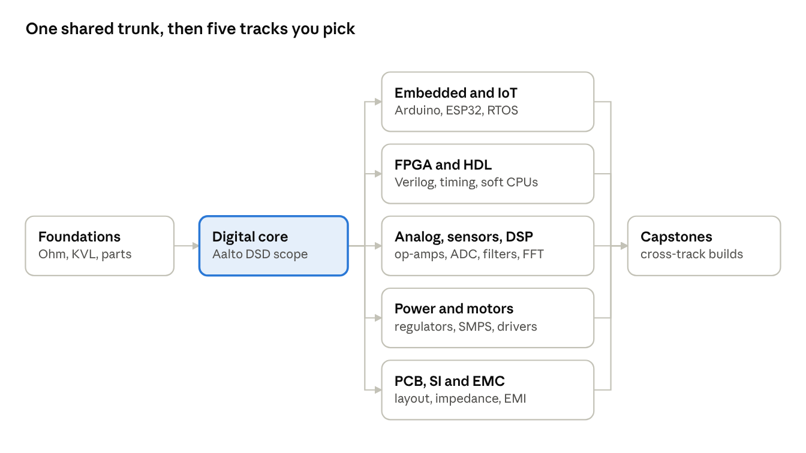

# SIGNAL PATH

**You are an electron. Get from the source to the sink, and learn how to build everything in between.**

A browser game for learning electronics: from Ohm's law and logic gates (the Aalto Digital Systems and Design core) through Arduino/ESP32 firmware, FPGA, analog, power, PCB layout and EMC. Circuits are really simulated, so broken designs fail the way real ones do: a reversed diode is a wall, a radiating trace pulls you off course.



## Status

Design phase. The full spec lives in [`docs/SPEC.md`](docs/SPEC.md):

- Concept, core loop and game modes (Electron Run, Breadboard Bench, Schematic Lab, HDL Forge, Firmware IDE, PCB Studio, Instrument Bench)
- Theory classes with curated video segments and 2D exam-style drills
- Learning map, placement test and skip system
- Six-tier fault library, from wiring mistakes to signal integrity
- Visual direction (black and phosphor green, Three.js + GSAP)
- Architecture and phased roadmap

## Planned stack

Vite · React · TypeScript · React Three Fiber · GSAP · Web Workers running a real-time MNA solver, ngspice (WASM), avr8js / rp2040js and Yosys (YoWASP).

## Run it

Needs Node 20+.

```bash
npm install
npm run dev      # test bench at http://localhost:5173
npm test         # solver test suite
npm run build    # typecheck + production build
```

## What's built

**Circuit solver** (`src/sim/`): modified nodal analysis in TypeScript with ideal parts.

- Parts: resistors, voltage and current sources, wires, switches, diodes, LEDs (by colour), capacitors
- DC operating point and transient steps (backward Euler) via `Simulator.step(dt)`, fast enough to run every frame
- Fault detection: short circuits, source conflicts, LED overcurrent and reverse overvoltage, floating nodes
- SPICE-like netlist format, e.g.

  ```
  V1 vcc 0 9
  R1 vcc a 330
  LED1 a 0 red
  ```

- `tests/`: textbook circuits checked against hand-calculated answers (dividers, bridges, LEDs, RC charge/discharge, energy conservation)

**Test bench** (`src/app/`): edit a netlist, see node voltages, currents and faults live, with a placeholder electron-flow strip in Three.js.

## Next up (Phase 0)

2D schematics and exam drills → Breadboard Bench → Electron Run → five World 0 levels → landing page.
