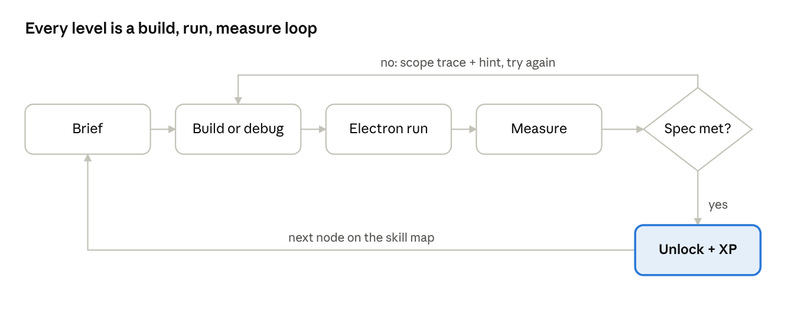
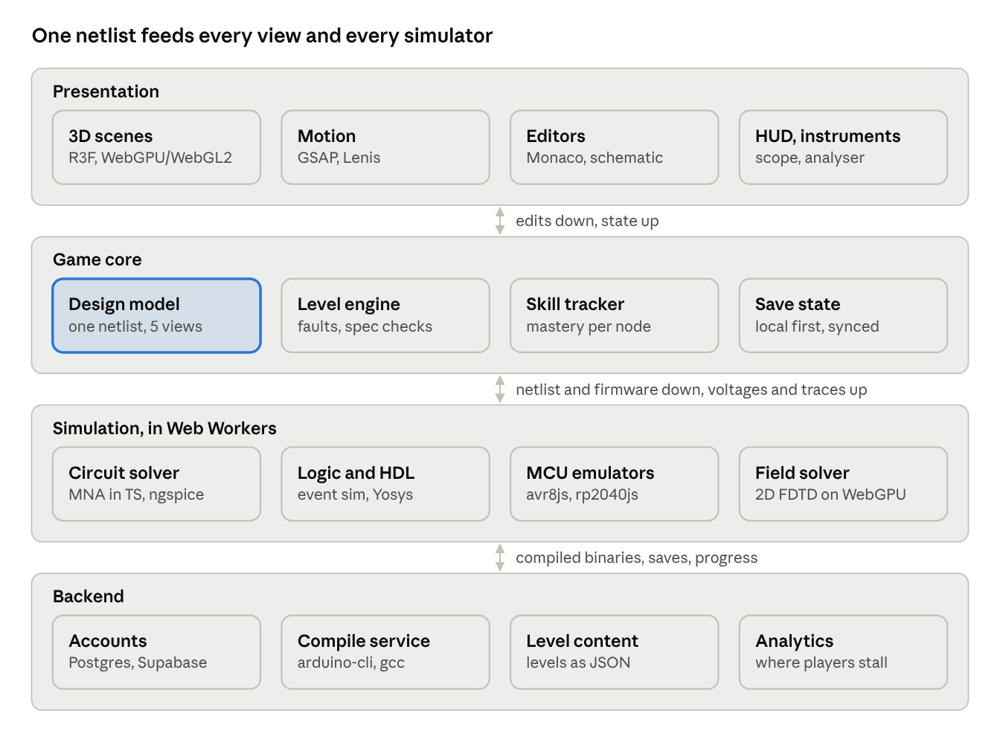
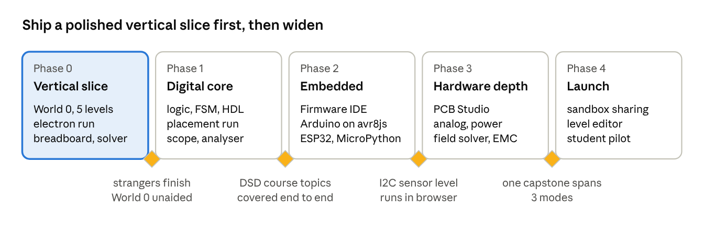

# SIGNAL PATH — Circuits Learning Game Spec

Mikael Salomaa · September 2026 · design spec (living copy in Claude Docs; this is a snapshot)

## Concept & pitch

**You are an electron. Get from the source to the sink, and learn how to build everything in between.** SIGNAL PATH is a browser game that starts with a single LED and ends with you shipping firmware to an ESP32, laying out a 4-layer PCB and chasing down EMI. Everything you build is simulated for real, so wrong designs fail the way real ones do.

- **Who it's for:** Aalto Digital Systems and Design students first (logic, sequential design, HDL, computer architecture, microcontrollers), then anyone going deeper into embedded, analog, power, PCB or FPGA work.
- **The fantasy:** you see the circuit from inside. Voltage is height, current is flow, noise is turbulence. When a diode is backwards you hit a wall. When a trace radiates, your electron gets pulled off course by the field.
- **What's different:** most circuit tools are either sandboxes (Falstad, Tinkercad) or quizzes. This is a campaign with real simulation underneath, a debugging-first challenge design, and a presentation good enough to put on a portfolio.
- **Working name alternatives:** e⁻, GROUND TRUTH, NET://, TRACE.

**Design pillars**

1. **Real physics, stylised view.** A SPICE-grade solver decides pass/fail. The visuals interpret it, never fake it.
2. **Debug before build.** Most levels hand you something broken. Finding faults is how engineers actually learn.
3. **Skip anything you already know.** Placement tests and challenge gates, never forced tutorials.
4. **Same circuit, many lenses.** Schematic, breadboard, PCB, code and oscilloscope are views of one design, and you can switch between them.

## Core loop & game modes

**Every level is one loop: read the brief, build or fix the circuit, ride it as the electron, measure it, and pass when the simulator says the spec is met.** Failing never just says "wrong": it shows the scope trace or the node voltage that broke.



The electron run is the payoff and the diagnostic: you see where current actually goes before you look at numbers.

**Modes.** Each mode is a lens on the same underlying netlist, so a circuit built on the breadboard can be opened as a schematic, laid out as a PCB, or driven by firmware.

| Mode | What you do | What it teaches | Core tech |
| --- | --- | --- | --- |
| Electron Run | Travel the live circuit in 3D. Junctions split you by current, resistors slow you, capacitors fill up, a reversed diode is a wall | Intuition for V, I, R, KVL/KCL, time constants, logic levels | Three.js scene generated from the netlist, speed and glow driven by solver output |
| Breadboard Bench | Place parts and jumpers on a 3D breadboard, probe with a multimeter | Prototyping, pinouts, power rails, the classic wiring mistakes | R3F, drag-and-snap, part library |
| Schematic Lab | Draw schematics, logic diagrams, truth tables, K-maps, FSM diagrams | Circuit theory and Boolean algebra, the core of the Aalto first-year courses | 2D canvas editor, netlist export |
| Logic & HDL Forge | Go from gates to FSMs to Verilog/VHDL, watch waveforms, "flash" a virtual FPGA board | Combinational and sequential design, timing, testbenches | Monaco editor, WASM Verilog simulator, WaveDrom-style viewer |
| Firmware IDE | Write C/Arduino or MicroPython for AVR, ESP32 and RP2040 targets, then watch the board run | GPIO, interrupts, timers, PWM, ADC, UART, I2C, SPI, RTOS basics | Monaco, WASM MCU emulators, virtual peripherals |
| PCB Studio | Place and route, pick a layer stack, run DRC, see return paths and fields | Layout, decoupling, impedance, grounding, EMC | 2.5D board renderer, simplified field solver |
| Instrument Bench | Scope, logic analyser, spectrum analyser and multimeter, usable inside every mode | Measurement as a skill, reading real waveforms | Shared overlay UI, reads solver and emulator traces |
| Field Incident (boss) | Timed, multi-mode debug scenario: "the board resets whenever the motor starts" | Putting it all together under pressure | Scripted faults over any of the above |

A free **Sandbox** unlocks every part and mode you have earned, and doubles as a portfolio tool (export a build as a shareable link).

### Source-traced flow and the analyser probe

**Every source gets its own colour, and the flow on each wire shows how much of it comes from which source.** A probe can then break any point's voltage, or any part's current, down into what each source contributes. It's the superposition theorem made visible.

- **Colour-coded flow:** in the Electron Run and on the breadboard, electrons carry the colour of the source that drives them (battery 1 green, battery 2 cyan, the current source amber). Where two sources share a wire, the stream is a mix in proportion to each one's share. Currents that oppose each other show as streams flowing in opposite directions, with the net flow brightest.
- **Analyser probe (Instrument Bench):** tap any node, wire or part.
  - **A node:** its voltage and a stacked bar of each source's contribution, e.g. "4.2 V = 3.0 V from V1 + 1.2 V from V2".
  - **A part:** the current through it, the voltage across it and the power, each split by source the same way.
  - **Drill link:** shows the superposition working ("switch off V2: here's what's left") and links to the superposition and Thevenin drills.

**How it's computed:** re-solve the circuit once per source with the others switched off (voltage sources shorted, current sources opened). The results add up exactly because the circuit is linear.

**Diodes and LEDs:** these aren't linear, so superposition doesn't strictly apply. We freeze each diode in the on/off state from the full solve. A diode that is on then behaves as a fixed voltage drop plus a small resistance. Each drop becomes its own entry in the breakdown ("−2.0 V across LED1"). The parts still sum to the true answer, and the display says the split is valid only at this operating point.

**When:** the colour-coded flow comes with the Electron Run (Phase 0 stretch goal). The analyser probe joins the Instrument Bench in Phase 1, alongside a superposition drill type.

### Learn and drill layer (outside the 3D game)

**Every skill node has two lightweight companions: a short theory class and a 2D exam drill set.** Players can use them on their own, like a study app, without ever opening the 3D view.

| Mode | What you do | Details |
| --- | --- | --- |
| Theory Classes | 5–15 minute lessons per skill node: a short written explainer, interactive 2D figures, and a linked YouTube video | Videos embedded with start/end timestamps so only the relevant few minutes play; 2–3 check questions after each video; "watched + passed" counts toward node mastery |
| Exam Drills (2D) | Flat, printable-style schematics and exam-type questions for getting reps | Randomised values each attempt; numeric answers graded with tolerance; step-by-step worked solution on request; mistakes feed spaced repetition |
| Exam Simulation | Timed set that mimics a course exam: no hints, mixed topics, score report at the end | Uses the Aalto path mapping; report lists weak skill nodes and links back to their classes |

**Drill question types**

- Circuits: node voltage and mesh analysis, Thevenin/Norton, dividers, RC/RL transients, op-amp configurations, diode and transistor operating points.
- Digital: number systems and two's complement, Boolean simplification, K-maps, completing timing diagrams, FSM state tables and diagrams, reading and fixing short VHDL/Verilog snippets.
- Embedded: register bit masks, baud and timer prescaler calculations, reading a datasheet table to pick a value.

**Video curation.** Each node links hand-picked segments from established channels, reviewed so the video matches the notation used in class. Candidate channels: Ben Eater (digital logic, breadboard CPU), Neso Academy (digital electronics theory), Afrotechmods and EEVblog (components, practical electronics), GreatScott! (hands-on builds), Paul McWhorter and DroneBot Workshop (Arduino), Andreas Spiess (ESP32), Phil's Lab and Robert Feranec (PCB design). Links stored in level JSON with timestamps, so a dead link can be swapped without touching code.

**Tech note.** Drills render 2D SVG schematics from the same netlist model, so they load fast, work on phones, and a drill circuit can be opened in the 3D Electron Run with one tap ("see it from inside"). The real-time solver grades answers and generates the worked solution.

## Learning map

**The map is a trunk that covers the Digital Systems and Design core, then splits into five tracks the player chooses.** Tracks cross-link (firmware needs power basics, PCB needs analog), so the map is a graph with soft prerequisites, not a strict tree.


The highlighted node is the Aalto-aligned scope; everything to its right is "beyond the course" content.

| World / track | Progresses from → to | Signature challenge |
| --- | --- | --- |
| 0 · Foundations | Charge, V/I/R, Ohm's law, series/parallel, KVL/KCL, dividers → diodes, LEDs, transistors as switches, multimeter use | Light an LED without killing it: pick the resistor from the datasheet Vf and If |
| 1 · Digital core | Number systems, Boolean algebra, K-maps → muxes, adders, decoders → latches, flip-flops, counters → Moore/Mealy FSMs → setup/hold and propagation delay → VHDL/Verilog → datapath, ALU, a tiny CPU and its assembly | Build a traffic-light FSM, then find why it glitches when inputs change near the clock edge |
| Embedded & IoT | Arduino GPIO, debouncing → timers, PWM, ADC → UART, I2C, SPI → interrupts → ESP32 Wi-Fi/BLE, MQTT, deep sleep → FreeRTOS tasks, queues, DMA → OTA and bootloaders | An I2C sensor returns 0xFF: missing pull-ups, wrong address, or 5V vs 3.3V? |
| FPGA & HDL | Testbenches → pipelining → clock-domain crossing and metastability → buses (AXI-lite) → a RISC-V soft core → timing closure | A design passes simulation but fails "on hardware": an unsynchronised input |
| Analog, sensors & DSP | RC/RLC, op-amps → active filters → sampling, aliasing, ADC/DAC → instrumentation amps → FFT, FIR/IIR | Clean a noisy biosignal: pick gain, filter order and sample rate so the heartbeat survives |
| Power & motors | Linear regulators, LDO dropout → MOSFET switching → buck/boost → H-bridges, motor drivers → batteries and protection | Board browns out when the servo moves: bulk capacitance, separate rails, or a flyback diode |
| PCB, SI & EMC | Footprints, DRC → decoupling, ground planes, return paths → controlled impedance, reflections, crosstalk → EMI, ESD | A 50 MHz clock fails EMC: find the trace crossing a plane split |
| Capstones | Cross-track builds that need 2–3 tracks | ESP32 weather station, line-following robot, EMG front end for a prosthetic hand, RISC-V on FPGA running your own firmware |

**Open question:** map World 1 against the actual course list (codes and weekly topics) so each level can show "covers week N of course X".

## Progression, skill evaluation and skip system

**Nothing is mandatory: players can start from zero, take a placement run, or jump straight to any world's gate exam.** The game tracks mastery per skill node, not per level, so skipping never leaves hidden holes.

**Three ways in (chosen on first launch, changeable any time)**

1. **Boot from zero.** Full campaign from World 0, guided hints on.
2. **Placement run.** A 10–15 minute adaptive diagnostic: size a resistor, simplify a K-map, fix an FSM, read a scope trace, spot a PCB fault. Each answer updates a per-skill estimate and picks the next question. Skills above threshold are marked *tested out* and their nodes unlock.
3. **Gate exam.** Every world ends in a gate. Take it cold at any time; pass it and the whole world opens as completed.

**Skip and review rules**

- A "skip level" button is always visible. Skipped levels are marked, not failed.
- Skipped or tested-out skills get resurfaced as faults inside later levels (a reversed diode hiding in a World 4 board). Miss it and the node is flagged for review.
- Spaced repetition: short "maintenance" puzzles for skills you haven't used in a while, 2–3 minutes each.
- **Aalto path toggle:** reorders World 1 to follow the course calendar and adds exam-style practice sets.

**Mastery and difficulty**

| Tier | How you earn it | What changes |
| --- | --- | --- |
| Bronze | Meet the spec | Node counts as done |
| Silver | Meet the spec with no hints | Unlocks the part for Sandbox |
| Gold | Beat par on cost, part count or time | Leaderboard entry, cosmetic trace colour |
| Hardcore mode | Real component tolerances (±5% resistors), supply ripple, noise, no hints | Required for capstone gold |

Ranks follow the signal path for flavour: *Electron → Carrier → Signal → Bus Master → Architect*.

## Challenge & fault design

**Challenges are built from a fault library of six tiers, from a backwards diode to a trace that radiates.** Each fault has a signature in the electron view, a signature on the instruments, and a fix the solver can verify. Levels mix faults from the current tier with one or two from lower tiers.

| Tier | Example faults | What the electron sees |
| --- | --- | --- |
| 1 · Wiring | Reversed diode, LED or electrolytic cap; no current-limit resistor; open joint; split breadboard rail; rail-to-rail short | A wall; a flood that ends in a burnt part; a dead end |
| 2 · Values & parts | Wrong colour code, wrong divider ratio, missing pull-up, floating input, swapped BJT pinout, no base resistor | Too slow or too fast; a node that jitters randomly (floating) |
| 3 · Digital & timing | Switch bounce, glitch hazards, setup/hold violations, inferred latches in HDL, unsynchronised async input, excessive fan-out | Bursts of duplicate electrons; arriving after the gate closes; a metastable wobble |
| 4 · Firmware & interfaces | UART baud mismatch, wrong SPI mode, I2C address or pull-ups, 5V into a 3.3V ESP32 pin, ESP32 ADC2 read while Wi-Fi is on, boot strapping pins, blocking code in an ISR, watchdog resets | Packets that arrive garbled; a pin that overheats; the board rebooting mid-run |
| 5 · Analog & power | Missing decoupling, regulator dropout, op-amp clipping at the rail, LDO oscillation, no flyback diode on a motor or relay, aliasing | Supply sagging under you; voltage spikes that knock you off the track |
| 6 · Signal integrity & EMC | Unterminated fast lines (reflections), crosstalk, trace crossing a plane split, large loop areas that radiate, ground bounce, ESD | Echo ghosts bouncing back; field lines pulling you off the trace; neighbouring traces lighting up |

**Level formats**

- **Find the fault:** a broken board and a limited probe budget. Fewer probes = higher score.
- **Build to spec:** "blink at 2 Hz from 9V, under 20 mA". Any valid design passes.
- **Optimise:** cut cost, power or part count while staying in spec.
- **Black box:** measure an unknown module and identify it (a filter, a regulator, a state machine).
- **Field incident:** a multi-fault story level mixing modes, used as world bosses.

The fault library doubles as a content engine: a level is a base circuit plus a list of injected faults, so new levels can be generated and difficulty tuned by fault count and tier.

## Visual, motion & audio direction

**The look is a phosphor oscilloscope in a dark lab: near-black space, green light that behaves like signal, and motion that always means something electrical.** Every animation should be readable as physics (propagation, charge, noise), never decoration.

**Palette and type**

| Role | Value | Use |
| --- | --- | --- |
| Background | #030604 to #07100A | Void, board substrate at depth |
| Signal green | #39FF88 (core), #0E3B26 (dim) | Traces, active current, primary UI |
| Copper / solder | #C87533, #D9D9D0 | PCB mode, breadboard metal |
| Warning amber | #FFB000 | Near-limit values, hints |
| Fault magenta | #FF2E88 | Faults (magenta, not red, so it reads against green for colour-blind players) |
| Type | JetBrains Mono or IBM Plex Mono for data; a wide grotesk (e.g. Space Grotesk) for display | Big editorial headings, small mono labels |

**Signature moments**

- **Landing page:** scroll drives a signal down a trace from a USB port to an MCU; each section lights a new part (GSAP ScrollTrigger + a Three.js scene pinned behind).
- **Semantic zoom world map:** the campaign map is one giant PCB. Zoom into a chip and it becomes a die with gates; zoom out and it's a device on a desk.
- **Electron view:** instanced GPU particles on SDF traces, curl-noise turbulence for noise, afterglow trails like scope persistence.
- **Transitions:** screen wipes as an oscilloscope sweep; UI panels "power on" with a CRT flicker and settle.
- **Post-processing:** bloom, subtle scanlines and chromatic aberration, film grain; all toned down in editors where readability matters.
- **Failure feedback:** a burnt part gets a smoke particle burst and a brief magnetic-field distortion; a short circuit whites out the bloom for a frame.

**Phosphor shader layer**

One shared WebGL post-processing layer gives every screen the look of a real phosphor tube, at three strengths: full on instrument screens, medium on 3D views, light on UI panels. A working demo is in [docs/demos/crt-phosphor-shader.html](demos/crt-phosphor-shader.html).

- **Passes:**
  - Persistence buffer with exponential decay that drifts warmer (P31 phosphor).
  - Beam brightness set by dwell time, so fast edges draw faint.
  - Two-level bloom: a tight glow plus wide halation.
  - Tube effects: barrel curvature, a tone curve with mint-white hot cores, a graticule on the glass that catches nearby glow, fine scanlines, vignette and grain.
- **Settings:** a toggle plus softness, afterglow and curvature controls. It switches off automatically on weak GPUs and in reduced-motion mode.

| Where | Strength | What it adds |
| --- | --- | --- |
| Instrument Bench (scope, logic analyser, spectrum) | Full | Probes on breadboard holes draw live waveforms on a phosphor screen; the multimeter readout gets a subtle version |
| Electron Run | Medium | Electrons leave phosphor trails, bloom makes current glow, per-source colour streams blend softly where they merge |
| Tier 6 levels (signal integrity, EMC) | Full | Reflections show as ghost echoes in the afterglow, noise as haze and jitter |
| RC and timing levels | Full | Afterglow keeps charge curves and switch bounce visible long enough to read |
| Landing page | Full | The scroll-driven signal is drawn through the shader |
| Transitions and world map | Medium | Screen changes as a scope sweep, panels power on with a CRT flicker, visited nodes glow |
| Firmware IDE serial monitor and plotter | Medium | UART output and live plots in phosphor style |
| Exam drills and 2D schematics | Light or off | Readability first: at most a faint glow, fully off in reduced-motion mode |

**Audio**

- Signals are audible: a 440 Hz square wave on a pin plays as a tone (Web Audio / Tone.js). PWM duty changes timbre; noise is hiss.
- Low ambient lab hum that shifts key per world; mechanical clicks for breadboard insertion.

**Accessibility**

- Faults are marked by shape and icon as well as colour.
- Reduced-motion mode swaps particles for static current arrows and removes flicker.
- All editors keyboard-navigable; captions for audio cues.

## Tech architecture

**One design model (a netlist plus part placements and firmware) is the single source of truth; every view renders it and every simulator reads it.** Simulators run in Web Workers so the 3D scene stays at 60 fps.



The highlighted Design model is what makes "same circuit, many lenses" work: switching from breadboard to PCB never converts data, it only changes the view.

**Key choices**

| Area | Choice | Why |
| --- | --- | --- |
| App shell | Vite, React, TypeScript, Zustand | Fast iteration, shared state between 3D and 2D UI |
| 3D | React Three Fiber, drei, postprocessing; three.js WebGPU renderer with WebGL2 fallback | Particles and compute for the electron view |
| Motion | GSAP (ScrollTrigger, Flip, SplitText) + Lenis | Awwwards-grade scroll and UI choreography |
| Real-time circuits | Custom modified nodal analysis (MNA) solver in TypeScript, Falstad-style | Needs to step every frame for the electron view |
| Verification | ngspice compiled to WASM | Accurate pass/fail on analog and power levels |
| Digital / HDL | Event-driven gate sim; Yosys via YoWASP for synthesis; a Verilog simulator in WASM | Browser-only, no server needed |
| MCUs | avr8js (Arduino Uno) and rp2040js; ESP32 path to decide (see risks) | Real instruction-level emulation, open source |
| MicroPython | MicroPython WebAssembly port | Lets beginners skip C |
| Fields | Simplified 2D FDTD on a WebGPU compute shader | Qualitative EMI and radiation visuals, not certification-grade |

**Level data** is plain JSON, so levels can be authored, versioned and generated:

```json
{
  "id": "w1-fsm-traffic-03",
  "skills": ["fsm.moore", "timing.setup-hold"],
  "base": "circuits/traffic_fsm.net",
  "faults": [{"type": "async-input-unsynced", "at": "btn_ped"}],
  "spec": [{"probe": "LED_R", "never_glitches": true}],
  "par": {"probes": 4, "time_s": 300}
}
```

## Roadmap, risks & open questions

**Build one world beautifully before building ten: Phase 0 is a portfolio-grade vertical slice that proves the solver, the electron view and the look together.** Each diamond is a gate that must pass before the next phase starts.



No dates yet; phase lengths depend on how many hours a week go into it.

**Phase 0 scope (the vertical slice)**

- [ ] Landing page with the scroll-driven signal animation
- [ ] Real-time MNA solver: sources, resistors, LEDs/diodes, switches, capacitors
- [ ] Breadboard Bench with multimeter
- [ ] Electron Run view generated from any World 0 circuit
- [ ] Five levels: LED + resistor, reversed diode, series vs parallel, voltage divider, RC blink timing
- [ ] Tier 1 fault library + "find the fault" format
- [ ] Local save, no accounts yet

Phase 0 also ships the World 0 theory classes (with curated video segments) and a 2D drill set of about 30 randomised exam-style questions, so the slice is useful for studying from day one.

**Risks**

| Risk | Mitigation |
| --- | --- |
| Scope is huge | Netlist model and fault library first; every later mode reuses them |
| No open-source, in-browser ESP32 emulator at instruction level | MVP: simulate the Arduino-ESP32 API at HAL level in JS. Later: evaluate Wokwi embedding (commercial terms) or Espressif's QEMU fork in WASM |
| Real-time solver drifts from real behaviour | Grade with ngspice, animate with the fast solver |
| Heavy visuals on student laptops | WebGL2 fallback, particle budgets, a "lab lights on" low-FX mode |
| Level authoring cost | JSON levels + fault injection generator + in-game level editor |
| Does it actually teach? | Pilot with a student group each phase; analytics on where players stall |

**Open questions**

- Final name and whether it stays a portfolio project or becomes a product (free core, paid tracks?).
- Exact Aalto course mapping for World 1 (codes, week-by-week topics).
- Arduino C compile: server-side arduino-cli, or clang in WASM to stay fully static?
- IoT levels could pull live data (weather, time, simple REST) for ESP32 exercises; shortlist free, keyless APIs from [public-apis/public-apis](https://github.com/public-apis/public-apis).
